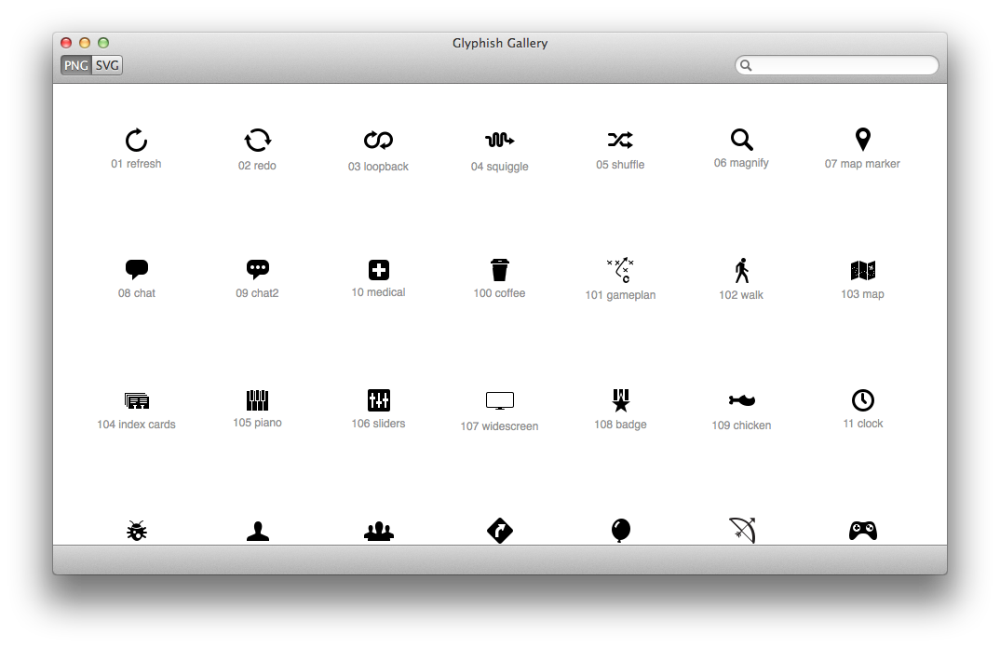
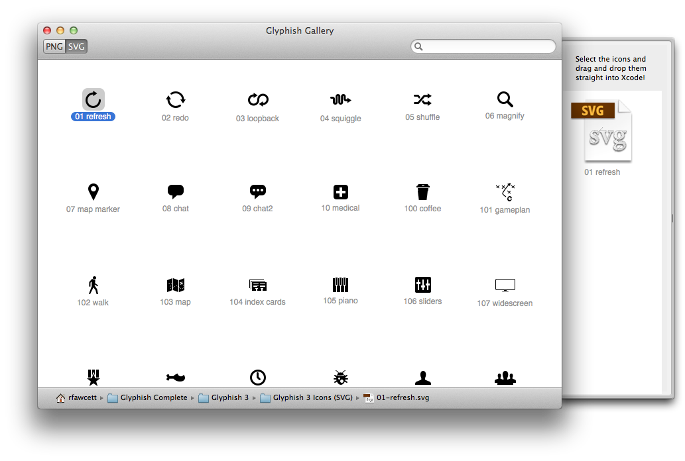
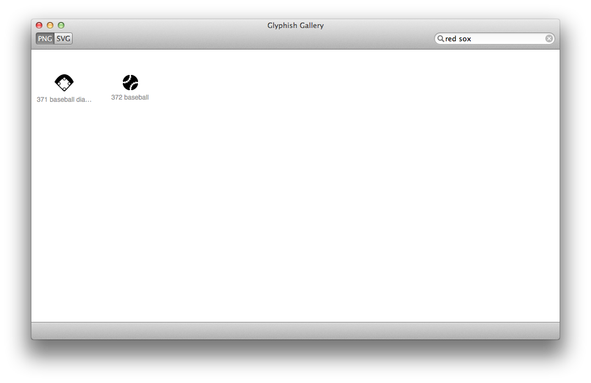

Glyphish Gallery
================

Browse and search through your [Glyphish icons](http://glyphish.com/) in style.



## Features

* Filter between PNG or SVG images*.

* Search through every icon, by name or tags.

* Drag and drop icons right into Xcode.

* Import your own metadata in a JSON file.


<i>*SVG icons included in the .zip with the 5/13 update.</i>

## Changing the Glyphish Folder
To change the location of your Glyphish folder (if it has been moved), or to update it, navigate to "Glyphish Gallery" and then "Preferences...".


Or, you can use the shortcut `⌘.`.

You will then get this preferences window:


On clicking "Pick", a popup file browser will then let you select the folder which you would like to use.  The gallery will then reload with the contents of the new folder.

## Creating Metadata
To edit or add to the master metadata, head on over to the [metadata](https://github.com/glyphish/metadata) repository.

To create your own personal metadata, follow these simple steps:

1. Create a new JSON file, such as `custom.json`.
2. Open the JSON file in your favorite editor.
3. Create an associative array, and use the icon name(s) as the key(s) (without the extension).

```json
{
  "01-refresh":[
  ],
  "02-redo":[
  ],
  // etc.
}
```

<p>4. Add the tags (in quotes) in the value (array) part of the JSON.</p>

```json
{
  "01-refresh":[
    "again",
    "reload",
    "circular arrow",
    // etc.
  ],
  "02-redo":[
    "try again",
    "refresh",
    "circular arrow",
    // etc.
  ],
  // etc.
}
```

<p>5. Save the file and <a href='#importing-metadata'>import the metadata</a>.</p>

## Importing Metadata

To import your own metadata .JSON file, you must first make sure that you have the correct [metadata format](#creating metadata).

After you have inserted all of your metadata, and saved the .JSON file in an easily accessible location, navigate to "Metadata" and then "Import".


Or, use the shortcut `⌘I`.

You'll then see this window:


Press "Pick", and a popup file browser will let you select a .json file.  Then, press "Import" or the enter/return key on your keyboard, and the file will be imported into Glyphish Gallery.

In the future, you will be able to navigate your imported metadata files, but for now, you can delete them by navigating to `/Users/rfawcett/Library/Application Support/Glyphish Gallery/`.  Because these files are stored locally, you will need to import them onto different computers, if you use Glyphish on different machines.  In the future, it is possible that theyr'e will be an option to choose a folder for your Glyphish metadata files, and you could create a folder in Dropbox, and keep them synced.
